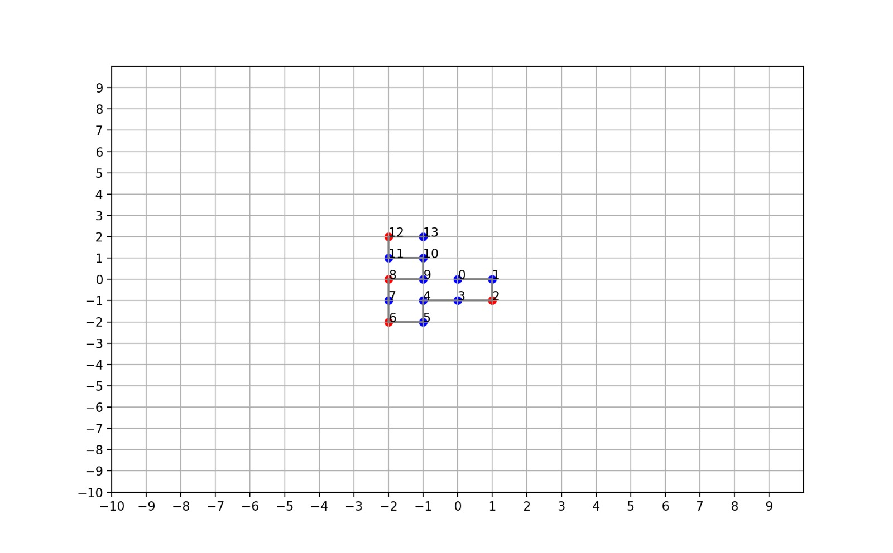

# Protein Pow(d)er

## Problem set 
This problem is about protein folding. A protein exists of aminoacids, that can be either hydrophobic (H), polar (P) or cysteine (C). Given the protein structure (the sequence of aminoacids) a protein can be folded in several ways. In this assignment, we assume proteins to be folded in a 2D grid in 90-degree-angles. Two aminoacids that face each other but are not connected are called a bond. A bond between two H-aminoacids or a H- and C-aminoacid makes a protein folding more stable. Therefore, for every HH-bond and CH-bond (or HC) the stability score decreases by 1 and 5 respectively. The lower the score, the higher the stability of the protein. However, in our algoritms we reversed this; hence a higher score means higher stability. The goal of our algorithms is to find (one of) the most optimal protein foldings, given a certain protein structure. See below an example of a protein folding, in which blue aminoacids are H's and red aminoacids are P's. Hence, the protein folding has four HH-bonds. In later examples, you will also see green aminoacids, which are the C's.

## Structure 
By running main.py one can run the six different algorithms successively. However, to explore one specific algorithm it is easiest to comment all other algorithms and only run the algorithm in question. The protein structure and number of times to run the algorithm can be adapted through the user input that is asked when running the algorithm. Right now main walks through all our algorithms, except the breadthfirst as we concluded that it takes to long for almost every protein structure to calculate the optimum this way. 

All complementing python scripts can be found in the Code folder, including algoritms, classes, and a code to create histograms. The results folder includes some first supporting figures to the functioning of the algoritms, which will be further explained during a presentation on January 31st. 

Examples of protein structures from the assignment are:
* HHPHHHPHPHHHPH

* HPHPPHHPHPPHPHHPPHPH

* PPPHHPPHHPPPPPHHHHHHHPPHHPPPPHHPPHPP

* HHPHPHPHPHHHHPHPPPHPPPHPPPPHPPPHPPPHPHHHHPHPHPHPHH

* PPCHHPPCHPPPPCHHHHCHHPPHHPPPPHHPPHPP

* CPPCHPPCHPPCPPHHHHHHCCPCHPPCPCHPPHPC

* HCPHPCPHPCHCHPHPPPHPPPHPPPPHPCPHPPPHPHHHCCHCHCHCHH

* HCPHPHPHCHHHHPCCPPHPPPHPPPPCPPPHPPPHPHHHHCHPHPHPHH

## Authors 
Tamar Vooijs (student nr: 12898635) and Rosa Janssen (student nr: 10790292)