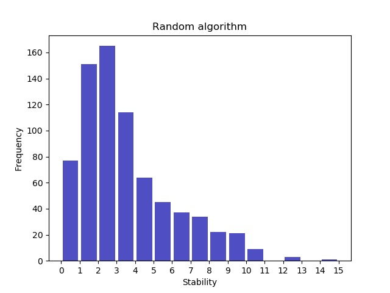
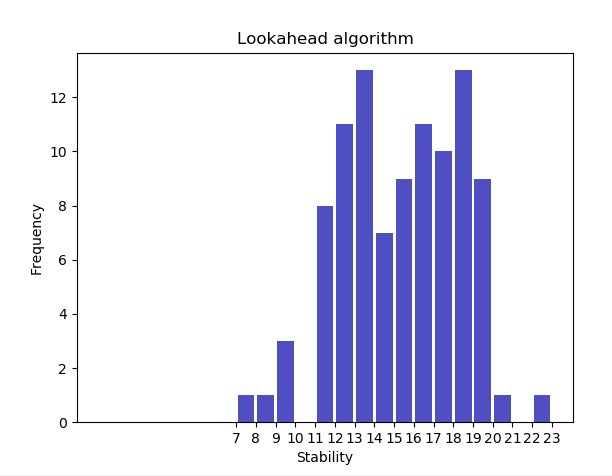

# Protein Pow(d)er 
## Results

Here one can find some initial results of the algoritms. The first histogram shows results of the random algorithm and the second histogram shows results of the breadthfirst look-ahead algorithm. One can see the frequency with which certain stability outcomes occur if the algorithm is being ran x times.

